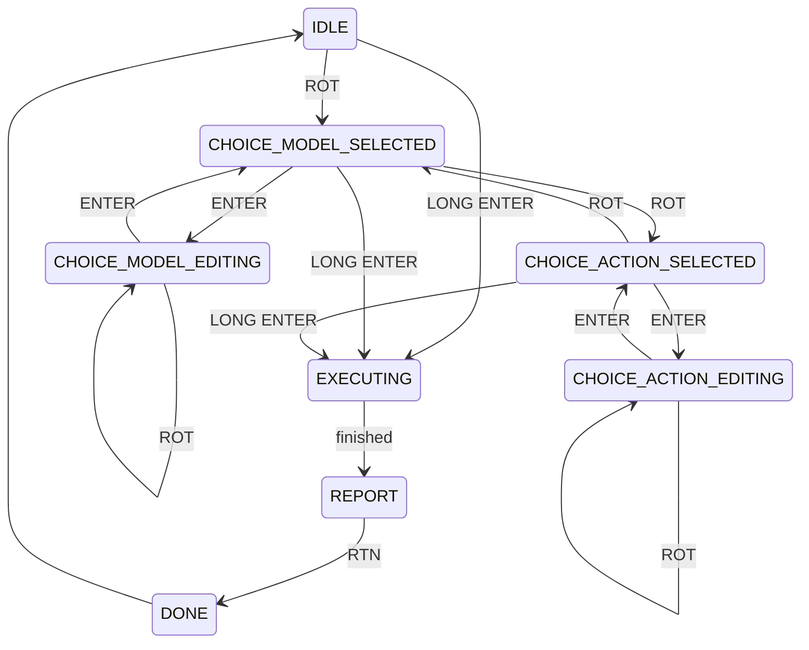

# LogManager
A tool for managing LOG-Files in an EdgeTX b/w or color RC transmitter.
Actions can be performed on all models or a selected model.

Since the color version is using the LVGL widgets API, EdgeTX version 2.11 or later is needed to run. However,
the b/w version can be used on color radios with older versions of EdgeTX.


 

## Model selection

 

## Actions
The following actions can be executed:
- Delete all empty logs
- Keep all logs recorded today
- Keep latest date: Keeps all log files for the latest flying day for the selcted model(s).
- Keep last flight: Keeps the latest log file for the selected model(s)
- Delete small log files with max size of 10 kB, 20 kB, 50 kB or 100 kB
- Delete all Logs: Deletes all log files found for the selected model(s)


## Installation
### Color screen Radios
Copy the file `LogManager.lua` to the folder `/SCRIPTS/TOOLS` on your transmitter.
Copy the files `colorui.lua`, `logfile.lua`, `logfiles.lua` and `uimodel.lua`
to the folder `/SCRIPTS/TOOLS/LogManager`
The structure on your SD card should look like this afterwards:
```
/TOOLS
    LogManager.lua
    :
    /LogManager
        colorui.lua
        logfile.lua
        logfiles.lua
        uimodel.lua
```
### Black and white screen Radios
Copy the file `LogManager.lua` to the folder `/SCRIPTS/TOOLS` on your transmitter.
Copy the files `bwui.lua`, `logfile.lua`, `logfiles.lua`, `selector.lua` and `uimodel.lua`
to the folder `/SCRIPTS/TOOLS/LogManager`
The structure on your SD card should look like this afterwards:
```
/TOOLS
    LogManager.lua
    :
    /LogManager
        bwui.lua
        logfile.lua
        logfiles.lua
        selector.lua
        uimodel.lua
```
### State diagram BW Radio

